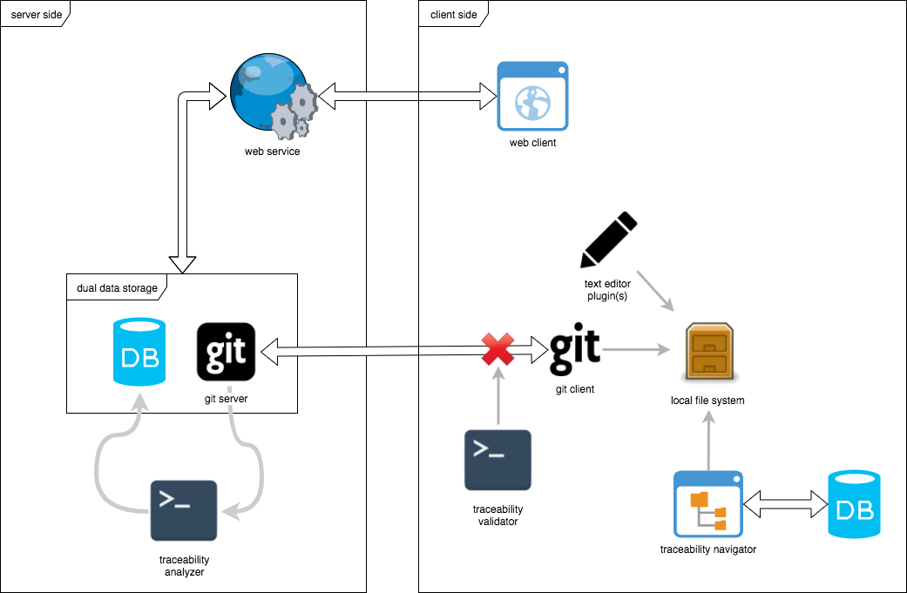
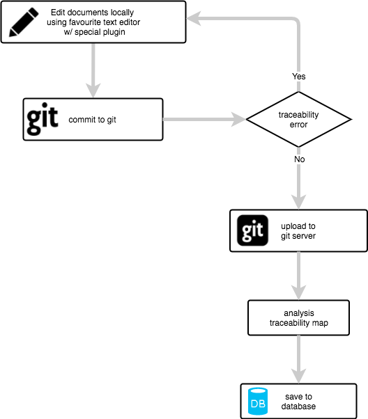
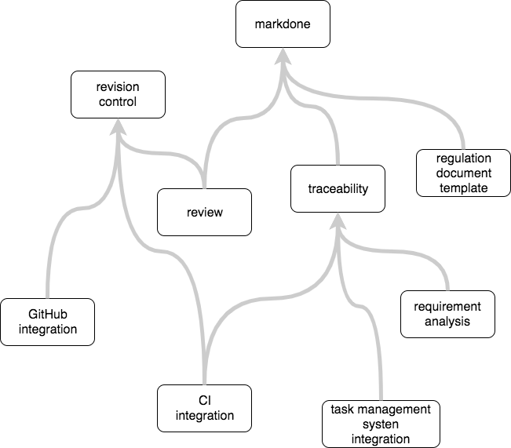

# System Architecture Description

## Introduction

### Purpose

### Scope

### Overview

## References

1. System requirements specification (SyRS).

## Definitions, acronyms, and abbreviations

### Definition

### Acronyms and abbreviations

## Design decisions

### Data storage

Notice that there are several different kind of data to be saved/cached in this system.

+ Document themselves.
+ Historical states of the documents.
+ Document metadata (author/change actor, date/time, version).
+ User authentication data (decide whether the user is the right person).
    + Note that software user is the git commit "pusher", who's not necessarily to be the git author of a historical commit. Also, a user may use multiple git clients with different git author setup.
+ User preferences.
+ Repository configurations.
+ User authorization (decide whether the user is allowed to access certain material) to repositories.
+ Caching of expansive calculations.
+ Online interaction data.

Document themselves, historical states, and document metadata are by-default saved in revision control system. User authentication cannot be saved in revision control system (as then everyone will have a local copy). Caching of expansive calculations and online interaction data is very hard to save in revision control system (will trigger confusing changes to modify the content of a historical git commit; or every tiny activity will trigger a new git commit with no meaningful structure in it).

The other parts also may saved in the revision control system (this is the Gitolite approach), with several associated pros and cons.

+ Pros:
    + The evolution history of configurations can be automatically recorded by git.
+ Cons:
    + Data can be only saved in plain text form.

Or they may be saved in a separated database (GitHub, BitBucket, GitLab, ... all go in this approach).

+ Pros:
    + Can define flexible database structure based on the requirements, as in general database is more flexible on saving data compare to a revision control system.
    + Have 3rd party data persistent tools we can use.
+ Cons:
    + Need to handle the complicity/consistency of query from different data sources.
    + Data may become fragile by technical reason splits.
    + Some data may need to have duplicated storage.

Our decision is to have repository configurations in configuration files (like CircleCI config) because they are:

+ Naturally associated to a git repository and/or a particular current state/commit of a repository.
+ If we need to do any document based calculation (like a git post-receive hook) we don't need to query database before start the analysis, and we only need to "write" to the database after the analysis finishes.

Other configurations are saved in the database.

- [SyAD-0004]{} The system shall be build on top of a dual data storage system of (1) a revision control system, and (2) a database.
- [SyAD-0063]{SyAD-0004} Document themselves are saved in revision control system.
- [SyAD-0064]{SyAD-0004} Historical states of the documents are saved in revision control system.
- [SyAD-0065]{SyAD-0004} Document metadata (author/change actor, date/time, version) are saved in revision control system.
- [SyAD-0066]{SyAD-0004} Repository configurations are saved in revision control system.
- [SyAD-0067]{SyAD-0004} User authentication data (decide whether the user is the right person) are saved in the database.
- [SyAD-0068]{SyAD-0004} User preferences are saved in the database.
- [SyAD-0069]{SyAD-0004} User authorization (decide whether the user is allowed to access certain material) to repositories is saved in the database.
- [SyAD-0070]{SyAD-0004} Caching of expansive calculations is saved in the database.
- [SyAD-0071]{SyAD-0004} Online interaction data are saved in the database.

### Revision control system

Comparison of version control platforms for satisfying our targeting functional requirements:

|            | Concurrent versions system (CVS) | Subversion (SVN) | git        |
| ---------- | -------------------------------- | ---------------- | ---------- |
| Regular backups by authors |  |  | Done as a series of commits in a separated branch |
| Pending changes/different opinions |  |  | Different branch |
| To-be-reviewed draft |  |  | Pull request from a different branch |
| Review approval as a group/management decision |  |  | Merge to the master branch |
| Separate code and document changes |  |  | Different branch. `git diff` to check if any document changes are involved. |

- [SyAD-0001]{SyRS-0001} The software shall be built on top of `git`.
- [SyAD-0048]{SyRS-0098} git commit SHA is used as the global version number of the document set.
- [SyAD-0055]{SyAD-0001} Local git client shall be able to synchronize with git server through (1) SSH and (2) password authorizations.

### Document formatting

- [SyAD-0002]{SyRS-0034} The document shall be written using a markdown format.
- [SyAD-0061]{SyAD-0002} The software shall define syntax on top of the markdown format to support extended functionalities.

For a comparison with other markup languages, we listed the cons of the alternative choices:

+ HTML:
    + Too complicated to be edited.
    + Most advanced layout setups are not useful for official documents.
+ LaTeX:
    + Not easy to read and edit.
    + Display math equations are not particularly useful for our case. And if really needed, can be done by extended text boxes (like what Wikipedia is doing).
    + The default PDF output is not easy to use for online activities (e.g. online review).
+ reStructuredText:
    + Really similar to markdown, just with a little bit less user and library supports.
    + If needed, we can easily switched in between the two or support both.

### Tag and traceability

- [SyAD-0006]{SyRS-0036} The plain-text-based tag shall be unique throughout the entire document system with multiple documents involved.
- [SyAD-0062]{SyAD-0006,SyRS-0074} Downstream items are fully calculable from upstream items.
- [SyAD-0007]{SyAD-0061,SyAD-0062,SyRS-0073} The traceable items are defined as extending the (unordered) bullet list items in markdown, with tag and upstream tags marked explicitly by a predefined syntax of markdown.

```
Optional block comments

- [currentItemTag]{upstreamTags,are,seperated,by,comma} Traceable item context.
    - Enumerate items in the traceable item context.
    + Optional inline comments.
    * Controversial issues/different approach?
```

- [SyAD-0028]{SyAD-0007} Beside the traceable item extension, the software shall fully support the original markdown syntax.
    - *(Should we further distinguish bubble list `-`, `+` and `star` for different purposes? E.g. to use the first order ones to distinguish todo/implemented/fully tested)*
- [SyAD-0008]{SyRS-0036,SyAD-0061} Tag names shall begin with a letter `a-zA-Z` or an underscore `_`. Subsequent characters can be letters, underscores, digits `0-9`, and hyphen `-`. Tag shall be case sensitive.
- [SyAD-0010]{SyRS-0010} The downstream items shall be automatically calculated from upstream items.
- [SyAD-0011]{SyAD-0010} The software shall raise exceptions if the traceability relationship contains errors.
- [SyAD-0024]{SyAD-0011} There shall be a client-side validator to raises traceability errors before the new changes are committed/uploaded to the server.
- [SyAD-0025]{SyAD-0062,SyAD-0010,SyAD-0011,SyAD-0070} There shall be a server-side analyzer which write the upstream/downstream relationship and save them into a database. The result is used in presenting in document display mode for user to navigate.

*(TODO: The tagging syntax for implementation anchors?)*

### Reviewing

- [SyAD-0057]{StRS-0057,SyRS-0028,SyAD-0001} The software shall be fully compatible with git (especially `git merge`) commands generated by other tools (locally, or through revision control platforms of other proposes), and/or workflow that doesn't follow the pattern of this software.
    - *(Then how it controls all document changes are follow the desired approach -- assuming users commit to the reviewing system?)*
- [SyAD-0032]{SyAD-0001,SyRS-0026} The user shall (be recommended to) handle regular backups by a series of commits in a separated branch.
- [SyAD-0042]{SyAD-0032} If multiple authors are editing the document simultaneously, they shall all (be recommended to) merge into the same (non-master) branch.
    - Since reviewing/merge to master is a once-in-a-while event, this is opposite to the concept of continuous deployment.
- [SyAD-0033]{SyAD-0001,SyRS-0026} The user shall (be recommended to) handle pending changes/different opinions in a separated branch.
- [SyAD-0034]{SyAD-0001,SyRS-0056} A review subsection is linked to a specific commit (contains to-be-reviewed drafts).
    - It is linked to commit, rather than branch, because in principle if the document has even been changed, it shall be reviewed again.
    - Even if there are new commits pushing to the same branch, the review subsection is always link to the previous commit.
- [SyAD-0058]{SyAD-0034} Review is suggested to be on commits in a non-master branch, which can later on follow the "Integration-Manager Workflow" pattern while merging.
- [SyAD-0043]{SyAD-0034} Updated documents based on the review comments shall be (recommended to) continuous pushed into the original branch, or a new branch created from the original branch.
- [SyAD-0044]{SyAD-0043,SyRS-0096} A new review subsection of the same series, shall be in the git downstream of the previous subsection.
    - For that, merge to master is, although a bad practice, satisfying this condition.
- [SyAD-0035]{yAD-0058,SyRS-0093} In case the review is in a non-master branch, the software shall handle review finalization as a merge to the master branch.
    - *(The user may want to do a more Agile approach, say in each tiny lifecycle change the requirement/design, modify the code and do test. They may only want to merge at the end. How to handle this case?)*
- [SyAD-0056]{SyRS-0063} Changes of documents not in the to-be-reviewed list, shall also be merged into the master branch.
    - Since otherwise it may break the consistency of the traceability relationship.
    - *(But this is conflict with the scenario of "Integration-Manager Workflow" pattern, since unconfirmed changes merge to the master. Should we at least check all changes not in the to-be-reviewed list, and vote for "Ok to Keep as Draft/Need to Revert"? The software can be smarter to distinguish the changes only involve traceability tag modification, and skip all those documents, through.)*
- [SyAD-0045]{SyRS-0093,SyAD-0035} When merging to the master branch, "Denial" documents shall be treated the same as document not being included. Changes will be kept, but document will not be included in the official final list.
    - We cannot revert the denial document, because that may break the consistency of the traceability relationship.
- [SyAD-0046]{SyAD-0001} Users are suggested to make document and code changes in different branches.
    - In most cases those changes are done by different groups of people.
- [SyAD-0047]{SyRS-0038,SyAD-0046} Separate document changes and other changes shall be done by checking if files returned by `git diff` are document/document accessories (images, ...).

### Authorization

- [SyAD-0040]{} There are multiple user management items related to this software.
    - A user.
    - An organization: it can be either an enterprise, a non-profit organization, a unofficial group, or some space some individual user registered.
    - A repository: it is the output of a project. It is a computer folder and its content includes a set of documents.    

Since requirement engineering and design control is mostly for enterprise uses, it is less likely that individual user will do it in their hobby projects. And for reviewing, it by-default cannot be done by a one-person project. Also, notice that individual user can always sign up an organization and put her projects there. Therefore, a project always belongs to some particular organization (unlike in GitHub that project can either belong to an organization or a user).

- [SyAD-0037]{SyAD-0040} An organization can have multiple users as its members. A user may be a member of more than one organizations.
- [SyAD-0038]{SyAD-0037} A member of an organization may have the following specific role:
    - A non-professional manager:
        - Define members by add/remove users into/from that organization.
        - Add/remove other users as non-professional managers.
        - Billing (if applicable).
- [SyAD-0036]{SyAD-0040} An organization can have multiple repositories. An repository can only belongs to one single organization.
- [SyAD-0053]{} Any user can create repositories. After a new repository has been created, the user becomes the project organizer of that repository.
    - *(Or we may go a more complicated approach that an organization has multiple teams, and each team can create its repositories. But in that case, we may simply register multiple organizations. So we keep it simple in this way.)*
- [SyAD-0041]{SyAD-0038,SyRS-0093} A project organizer of an repository is in charge of:
    - Choose/switch between the opinions whether the repository is private or public.
    - Add/remove other users as project organizers.
    - Authorize members (include herself) particular privilege of the corresponding repository, or choose the opinion whether users in some particular role can add particular privileges for themselves.
    - Setup the logistics of a review activity.
    - Organize the approval process of a review meeting.
        - *(But then should this person be the pertinent manager, as she holds the liability on the decision? Or should there be a more complicated interface to let the project organizer to forward the documents to the manager for final decision?)*
- [SyAD-0039]{SyRS-0088,SyAD-0041} A user may hold one of the following roles of a repository (She cannot hold multiple roles):
    - Document editor.
        - This is the general role, rather than an temporary editing authorization for a particular amount of time and/or for some particular part of the document. This is for simplicity concerns.
        - Assigned by the project organizer. Or the project organizer may decide that anybody who can read and/or review may promote herself ads a reviewer.
    - Document reviewer.
        - Assigned by the project organizer. Or the project organizer may decide that anybody who can read may promote herself ads a reviewer.
        - *(Document reader may be code editor. But if document and code stay in the same repo, then git push authorization need to distinguish which is which. Or we may forbidden update/merge to master in user's platform.)*
    - Document reader.
        - By default all users are readers of a public repository. While for private repository, all users belong to the same organization are by default the readers.
        - The project organizer may setup a blacklist of who cannot read the repository (for both public and private ones). That will also automatically remove the user to the reviewer/editor roles.

### Configuration

- [SyAD-0072]{SyAD-0066} There should be configuration file(s) define the setups and feature toggles of the corresponding repository.

We can either have configuration file to record what is included, or what is excluded.

Typically if we go with what is excluded, at the same time we (just like `.gitignore`)

+ Don't need structure of the configuration file. Just need it to have a plain array of excluded items.
+ Decide which file for which feature completely by pattern matching (e.g. file extension).
+ Can have multiple configuration files, one in each nested folder. The final file to be excluded is the *union* of all the parent folders.

If we go with what is included, at the same time we

+ Have structured configuration file. May have different session for different features.
+ Should have only one configuration file, staying in the root.

We'll go with the inclusion approach, because it

+ Exclude everything by default, so will not trigger a lot of unnecessary (traceability) analysis for a project not fit into the system yet.
    + *(Like GitHub hooks, we can technically skip it for a commit not in HEAD of a push through. So then it is not that horrible.)*
+ Can explicitly mark the "documents" so can support dual view. Then we can exclude e.g. `README.md` in code, to be a document.

- [SyAD-0013]{SyAD-0072} There shall be one configuration file used for this system.
- [SyAD-0060]{SyAD-0013} The configuration file is in YAML format.
- [SyAD-0059]{SyAD-0013,SyAD-0060} The configuration file stays at the root of the repository, and may be named `.gitenter.yml`, `.gitenter.yaml`, `.gitenter-config.yml` or `.gitenter-config.yaml`.

Reviewing is generally for documents (regardless of whether they contain traceable items), while traceability is for anything contains traceable items (may include not only document, but also Gherkin/unittest/...). There's no need for (and we can't make) the two to be the same set.

- [SyAD-0054]{SyAD-0060} Example `.gitenter.yml`
    - Path can be either subfolder or matching pattern.
    - `traceability.documents` should be a subset of `documents`. If not, the intersection is applied.
    - We may add the list of supported traceability formats in the future.

```yml
version: 1

documents:
    - requirements/*.md
    - design_doc
    - meeting_notes

traceability:
    markdown:
        - requirements/*.md
        - design_doc
    gherkin:
        - integration_test/
    java:
        - src/tests/java
```

### Feature toggle

There shall be several different level of feature toggles, starting from the weakest one which can be overwritten:

+ System-wise default value.
+ Repository level.
    + Notice that some features can only be on if specific setups are done (e.g. third party integration).
    + Shall only include a subset of (display-related) features.
    + *(Setup through configuration file? Through web UI?)*
+ Personalized level:
    + Setup per user.
    + Shall only include a subset of (display-related) features.
    + If not applicable for some particular repository (e.g. third party integration), then the feature will be force disabled.
+ System-wise enforced:
    + For turn off the features only.

## Decomposition description

### Module decomposition

So from a direct interacting with the requirement, the software shall include the following components:

- [SyAD-0019]{SyAD-0006,SyRS-0031} Text editor plugin, for:
    - Generate unique tag.
    - Provide template.
- [SyAD-0050]{SyRS-0010} Client-side document traceability navigator.
    - So users can navigate between traceable items while editing files on-the-fly.
    - It can be either part of the editor plugin, or an independent application. But since relation is hard to be build on-the-fly with a non-immediately algorithm, a local cache/database need to be involved.
- [SyAD-0022]{SyAD-0010} Client-side traceability validator.
    - Optional installed.
- [SyAD-0018]{SyAD-0010} Server-side traceability analyzer.
    - The other possibility is a client side traceability analyzer (not only validator), which later send the analysis result to the server (through some messaging system). The benefit is it may reduce the load of the web server. However, We are not doing it, because it has several shortcomings:
        - Hard to check if the data comes from the user's side is correct. Otherwise it may break the database consistency.
        - User has must-have client side installation -- it is extremely troublesome as our newest system need to be compatible with old client installations.
        - Makes integration with other revision control tools (GitHub, ...) impossible.
- [SyAD-0020]{SyAD-0004} `git` revision control system.
- [SyAD-0021]{SyAD-0004} Database.
- [SyAD-0017]{SyRS-0046} Web service(s), for:
    - Document visualization.
    - Reviewing.
    - User management.

Notice that several modules may share the following libraries:

- [SyAD-0051]{SyAD-0007,SyAD-0050,SyAD-0022,SyAD-0018,SyAD-0017} Modified `markdone` parser.
- [SyAD-0052]{SyAD-0050,SyAD-0022,SyAD-0018} Traceability analysis algorithm.

Local application is limited for document traceability, with the following concerns:

+ Several markdown preview tools can be used for a simple visualization of markdown files.
+ Several git GUI clients (`gitg`, `gitkraken`) can be used for checking historical versions. And they are generally not useful unless you are the editor of the document.
+ The crucial part that the existing tools cannot provide, is the traceability items with links to upstream/downstream items. However, since a traceability analysis is needed before displaying, we need a local database (maybe a SQLite) to hold the result. That will involve further complication (and potential combination of part of the functions of the traceability validator), we will not implement it right now.



There are additional design decisions after the previous module decomposition.

- [SyAD-0029]{SyAD-0022} The traceability validator shall be in form of client side git hook.
- [SyAD-0030]{SyAD-0018} The traceability analyzer shall be in form of server side git hook.

For the different kind of web services, there may be one or multiple web server(s) to do the job. For a comparison:

+ One web server:
    + Pros:
        + A highly decoupled implementation is to have lots of microservices (through a RESTful API). In that case it makes no sense to have more than one same/different web server/architecture.
        + There are standard way to do load balancer later.
    + Cons:
        + The crashing/overload of one part will affect the other.
+ Multiple web servers:
    + Pros:
        + It can reduce the server load, since people coming for different reasons end up connecting to different servers.
    + Cons:
        + More complicit implementation. Further questions raise such as weather they should share a database or not, or simply how to split to different servers.
        + Notice that document visualization and reviewing are highly related to each other (and they are also for the same group of people), these two probably cannot be separated. User management have relatively small traffic/load. So this strategy can't really help reduce server load.

We'll not implement the microservices at this moment, but will choice the one server architecture to make things simple.

- [SyAD-0031]{} All different web services shall be on a single web server.

### Process decomposition



## Dependency description

### Intermodule dependencies

Since user may only want to use part of the features provided by this software, we want to make different features as independent as possible. Here is the dependency between key features:



Here maps the key features to the existing modules:

|                                 | review only  | traceability only | all features            |
| ------------------------------- | ------------ | ----------------- | ----------------------- |
| Text editor plugin              |              | X                 | X                       |
| (client) traceability navigator |              | X                 | X                       |
| (client) traceability validator |              |                   | X                       |
| (client) git                    | X            |                   | X                       |
| (server) traceability analyzer  |              |                   | X                       |
| (server) git                    | X            |                   | X                       |
| (server) database               | X            |                   | X                       |
| web service                     | X            |                   | X                       |

### Interprocess dependencies

## Interface description

### Module interface

### Process interface

## Appendices

### Assumptions and dependencies

## Bibliography

1. ISO/IEC TR 24748-1, Systems and software engineering -- Life cycle management -- Part 1: Guide for life cycle management
2. ISO/IEC/IEEE 15288:2008, System and software engineering -- System life cycle process.
3. ISO/IEC/IEEE 42010:2011, Systems and software engineering -- Architecture description
4. IEEE Std 1016:1998, IEEE recommended practice for software design descriptions.
5. MIL-STD-498 (Military-Standard-498) DI-IPSC-81432, System/subsystem design description (SSDD).
