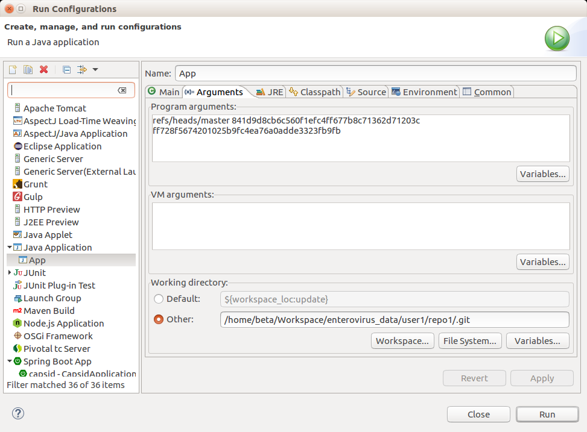

# Various Git Hooks

## Test independently

The executable `.jar` will finally run as git hooks. To test independently, the easiest way is setup `Run Configurations` in eclipse to a fixed git repository.

## Deployment

Compile using `mvn clean compile assembly:single` (rather than `mvn package`) so the dependencies (`gitar`, `jgit`, and more...) will be in the same jar.

The executable `.jar` should be later moved to `capsid/src/main/resources/git-server-side-hooks` for further uses.
